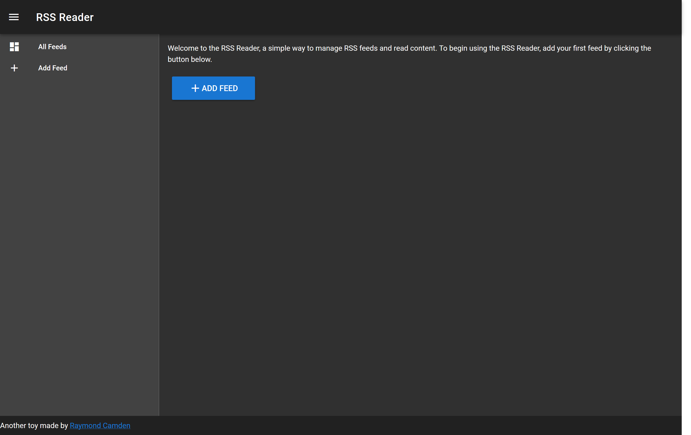
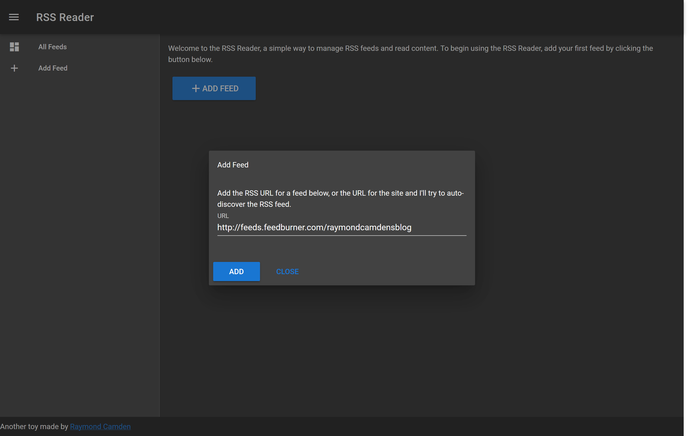
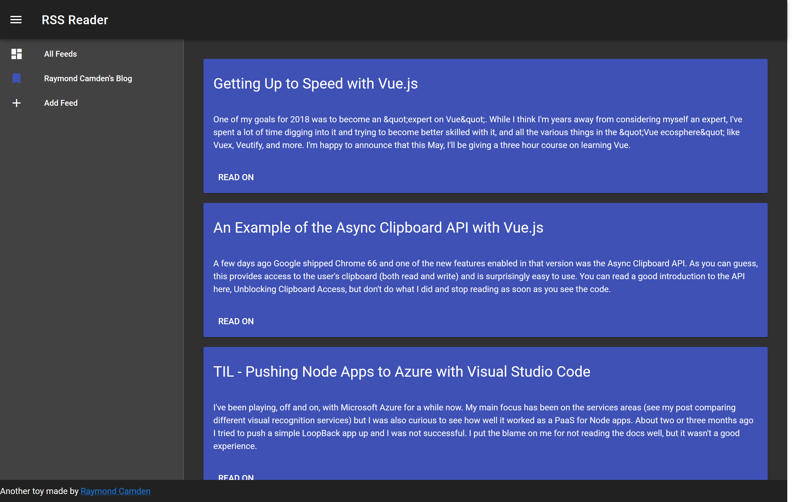
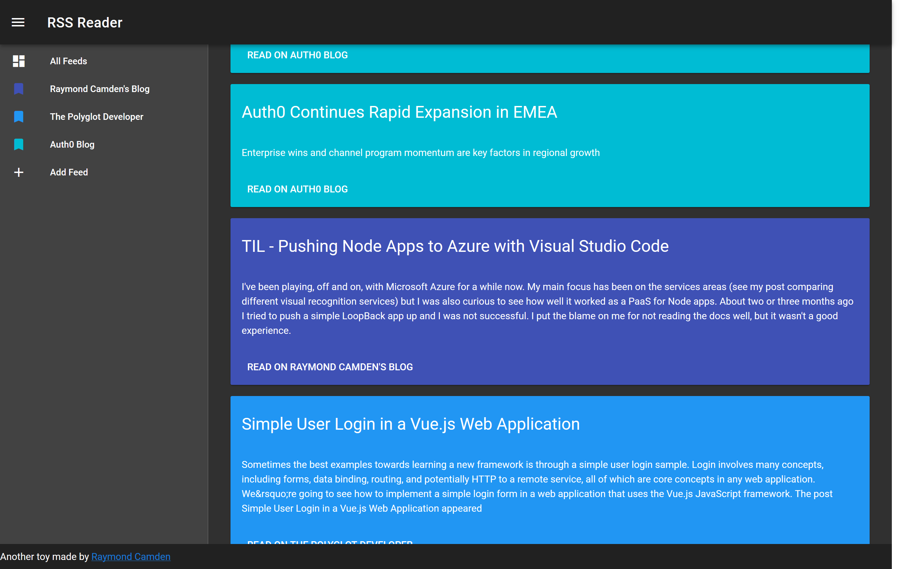
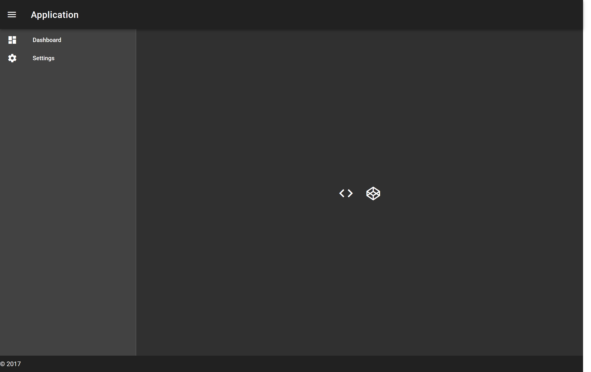

## Building a RSS Viewer with Vue (The Ugly First Version)

As I explore, and learn, and most importantly, *play*, with Vue.js, I've been building different types of apps as a way to get practice with and improve my use of Vue. A few weeks ago I was reading about the [shut down](https://thenextweb.com/apps/2018/03/15/digg-reader-is-shutting-down-this-month-here-are-3-great-free-alternatives/) of Digg's RSS Reader and while great alternatives exist (see the previous link), I thought it would be fun to build my own with Vue. In this article I'm going to explain how I put it together and also what's wrong with it. Getting into this I knew I was going to make some compromises so the plan is to follow up this version with a nicer one. 

Let's start by looking at the app an explaining the various components. You can run this version yourself here: https://cfjedimaster.github.io/webdemos/vuerss/. The source may be found here: https://github.com/cfjedimaster/webdemos/tree/master/vuerss. (And as I said, I plan on doing a major update, but in order to preserve the 'before and after' aspect I'll use a separate folder.)

When initially opening the application, you're presented with some basic instructions and a prompt to add a new RSS feed.



Clicking the button opens a modal letting you enter a feed:



You'll notice that my blog's RSS feed is defaulted there. I did that because I was sick and tired of copying a URL into the field. In the final version I'll remove that. 

Once you add the button, the blog entries for that feed will be displayed:



Notice the color. I set it up so that each feed would have a unique color - making it easier to tell one site's content from another. For example, here is how it looks with more feeds added.



The panel on the left lets you filter by clicking on a feed. Unfortunately you can't delete a feed yet so if you need to remove something you'll need to open up your devtools and edit the cached value. Speaking of that - let's go over the tech stack!

### The Components

First and foremost is Vue.js, of course. I'm not using webpack for this application, just a simple script include with no build process.

The UI is all [Vuetify](https://vuetifyjs.com/en/), a very nice and (mostly) easy to use material design framework. I'm still learning it so you can be sure that my design could be done better, but I'm really happy with how it looks now.

Persistence is done via LocalStorage. I store the feed metadata retrieved from the RSS feed. This typically includes things like the name of the site, the main URL, and a description. I do not store feed items which means every time you load the site, I re-fetch items. The next version will keep items locally using IndexedDB.

So how do I load feed information? I could just make a network request to the URL, but most RSS feeds aren't making use of CORS which means the browser would be blocked from loading it. To get around this, I wrote a quick serverless function with [Webtask](https://webtask.io/). It handles both creating a CORS friendly endpoint as well as parsing the feeds XML into friendly JSON.

Now that I've covered the various parts of the application, let's start looking at the code!

### The Layout

Let's start with the layout. As I said, I'm using Vuetify for the UI. I started off using the [dark sample layout](https://vuetifyjs.com/en/examples/layouts/dark). This is what creates the header, footer, and left column used for the menu. 



For individual feed items I used the [card component](https://vuetifyjs.com/en/components/cards). I'm not quite happy with the layout here. For example, I don't have publication dates rendered yet as I had trouble finding a nice way to render it. I decided to simply punt and wait till the next version. 

Instead of dumping the entire source code on you at once, let's look at the individual parts. First, here's the introductory/help text used when you don't have any feeds yet.

```html
<div v-if="showIntro">
	<p>
	Welcome to the RSS Reader, a simple way to manage RSS feeds and read content. 
	To begin using the RSS Reader, add your first feed by clicking the button below.
	</p>
	<p>
		<v-btn color="primary" large @click="addFeed"><v-icon>add</v-icon>Add Feed</v-btn>
	</p>
</div>
```

When you do have feeds, items are displayed as a list of cards:

```html
<v-container fluid grid-list-lg>
	<v-layout row wrap>
		<v-flex xs12 v-for="item in items">
			<v-card :color="item.feedColor">
				<v-card-title primary-title>
					<div class="headline">{{item.title}}</div>
				</v-card-title>
				<v-card-text>
					{{item.content | maxText }}
				</v-card-text>
				<v-card-actions>
					<v-btn flat target="_new" :href="item.link">Read on {{item.feedTitle}}</v-btn>
				</v-card-actions>
			</v-card>
		</v-flex>
	</v-layout>
</v-container>
```

Note the button for reading a feed item uses a `target` to open it up in a new tab. 

To display your feeds, I use a list component:

```html
<v-list dense>
	<v-list-tile @click="allFeeds">
		<v-list-tile-action>
			<v-icon>dashboard</v-icon>
		</v-list-tile-action>
		<v-list-tile-content>
			<v-list-tile-title>All Feeds</v-list-tile-title>
		</v-list-tile-content>
	</v-list-tile>
	<v-list-tile @click="filterFeed(feed)" v-for="feed in feeds" :value="feed == selectedFeed">
		<v-list-tile-action>
			<v-icon :color="feed.color">bookmark</v-icon>
		</v-list-tile-action>
		<v-list-tile-content>
			<v-list-tile-title>{{ feed.title }} </v-list-tile-title>
		</v-list-tile-content>
	</v-list-tile>
	<v-list-tile @click="addFeed">
		<v-list-tile-action>
			<v-icon>add</v-icon>
		</v-list-tile-action>
		<v-list-tile-content>
			<v-list-tile-title>Add Feed</v-list-tile-title>
		</v-list-tile-content>
	</v-list-tile>
</v-list>
```

Finally, here is the modal layout:


```html
<v-dialog v-model="addFeedDialog" max-width="500px">
	<v-card>
		<v-card-title>Add Feed</v-card-title>
		<v-card-text>
			Add the RSS URL for a feed below, or the URL for the site and I'll try to 
			auto-discover the RSS feed.
			<v-text-field v-model="addURL" label="URL" :error="urlError"
			:rules="urlRules"></v-text-field>
		</v-card-text>
		<v-card-actions>
			<v-btn color="primary" @click.stop="addFeedAction">Add</v-btn>
			<v-btn color="primary" flat @click.stop="addFeedDialog=false">Close</v-btn>
		</v-card-actions>
	</v-card>
</v-dialog>
```

### The Logic

Now for the fun part - the JavaScript! As before, I'm not going to dump the entire file on you. Instead, let's tackle it bit by bit. 

On start up, I load any existing feeds you may have defined and then display the intro if needed:

```js
created() {
	this.restoreFeeds();
	if(this.feeds.length === 0) this.showIntro = true;
},
```

The `restoreFeeds` method handles checking LocalStorage for existing feeds.

```js
restoreFeeds() {
	let feeds = localStorage.getItem('feeds');
	if(feeds) {
		this.feeds = JSON.parse(feeds);
		this.feeds.forEach((feed,idx) => {
			feed.color = colors[idx % (colors.length-1)];
			this.loadFeed(feed);
		});
	}
},
```

Note that this method handles assigning a color (which is a simple array) and then loading feed data. 

Speaking of that, how do I handle loading RSS information? Currently there's two times this happens. First when you initially add the feed and second when you reload the application and the feed was already defined. In both cases I call one URL - the serverless task defined with Webtask. This task will return everything - the metadata about the feed and the items itself. I only care about the metadata on the *first* call and in theory I could made the code a bit quicker by removing the metadata at the server side and strip that out, but it didn't seem like it was worth the effort. 

That serverless function is rather simple:

```js
'use strict';

const Parser = require('rss-parser');
const parser = new Parser();

module.exports = function(context, cb) {
	let url = '';
	if(context.body && context.body.url) url = context.body.url;
	if(context.query && context.query.url) url = context.query.url;
	if(url === '') cb(new Error('URL parameter not passed.'));
	console.log('gonna parse '+url);
	
 	parser.parseURL(url)
	.then(feed => {
		console.log(feed);
		cb(null, {feed:feed});
	})
	.catch(e => {
		cb(e);
	});
	
}
```

All I'm doing here is wrapping a npm package, [rss-parser](https://www.npmjs.com/package/rss-parser), that handles all the converting for me. The `if` statements you see in the beginning handle looking for the `url` parameter. When calling my webtask, I can either pass a query string variable or send it as part of a HTTP body. Either way, I simply use the `rss-parser` module and return the result. 

The end point for this function is https://wt-c2bde7d7dfc8623f121b0eb5a7102930-0.sandbox.auth0-extend.com/getRss and you're welcome to try it out yourself. You can see this being used in the method handling adding a feed:

```js
addFeedAction() {
	this.urlError = false;
	this.urlRules = [];
	//first, see if new
	if(this.feeds.findIndex((feed) => {
		return (feed.rsslink === this.addURL);
	}) >= 0) {
		this.urlError = true;
		this.urlRules = ["URL already exists."];
		return;
	} else {
		fetch(rssAPI+encodeURIComponent(this.addURL))
		.then(res => res.json())
		.then(res => {
			// ok for now, assume no error, cuz awesome
			this.addURL = '';

			//assign a color first
			res.feed.color = colors[this.feeds.length % (colors.length-1)];

			// ok, add the items (but we append the url as a fk so we can filter later)
			res.feed.items.forEach(item => {
				item.feedPk = this.addURL;
				item.feedColor = res.feed.color;
				this.allItems.push(item);
			});

			// delete items
			delete res.feed.items;

			// add the original rss link
			res.feed.rsslink = this.addURL;

			this.feeds.push(res.feed);
			this.addFeedDialog = false;

			//always hide intro
			this.showIntro = false;

			//persist the feed, but not the items
			this.storeFeeds();
		});
	}

},
```

This method first checks if a feed already exists and if it doesn't, it hits the serverless endpoint to get the details. I've got a bit of data duplication going on when I store items. I didn't want to store items "under" a feed object and instead use a global Vue data value, `allItems`. Therefore I copy the feed identifier and color into each item. The idea was to make it easier to do item display and filtering later. This feels "wrong" to me but again - this is my first draft. I'm using a computed property for items and you can see that logic here:

```js
items:function() {
	if(this.allItems.length === 0) return [];
	// filter
	let items = [];
	if(this.selectedFeed) {
		console.log('filtered');
		items = this.allItems.filter(item => {
			return item.feedPk == this.selectedFeed.rsslink;
		});
	} else {
		items = this.allItems;
	}
	items = items.sort((a, b) => {
		return new Date(b.isoDate) - new Date(a.isoDate);
	});

	return items;
}
```

Looking at it now - I could 'gather' my items from each feed instead of storing one global array. As I said, I could address this, if I want, later. I love that Vue gives me options for how to solve things like this. 

### Where Next?

When I started this article, I explicitly said - this was a first draft. I've kind of pointed out things here and there I didn't like, but what exactly do I plan for the next version?

* I want to move all the data access into [Vuex](https://vuex.vuejs.org/en/). Vuex is described as a "state management pattern + library" for Vue. If that doesn't make much sense to you, don't worry. I had no idea what it meant at first either. To me, Vuex provides a way to handle more complex data in an encapsulated manner. This becomes even more important as you start building more components that need to share data. 
* Speaking of components, I should consider making "item" a proper Vue component. That's an easy win.
* I want to start storing feed items in IndexedDB so you'll get content the second you open the application. This will make the application much more performant and provide basic offline support. Of course, you can't read the full entries if you're offline, but at least *something* could be provided.
* And... anything you suggest below! Take a look at the code (https://github.com/cfjedimaster/webdemos/tree/master/vuerss) and feel free to make suggestions and point out mistakes!

