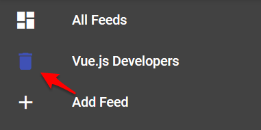
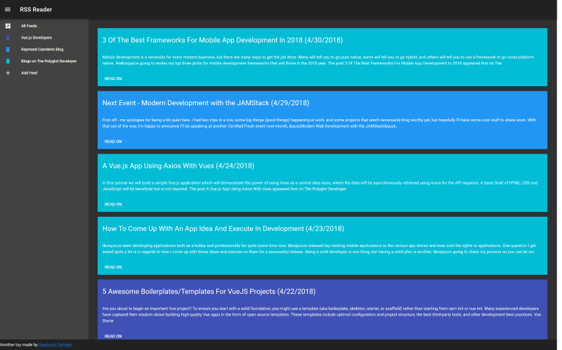

## Building a RSS Viewer with Vue (The Slightly Less Ugly Second Version

Welcome to the follow up to my [previous entry](LINK TBA) on building a RSS viewer with Vue. In the last article, I walked through how I built my demo using Vue.js and [Vuetify](https://vuetifyjs.com/en/) on the front end and [Webtask](https://webtask.io) on the back end. When I built that initial version, I knew it was exactly that - an "initial" version. I took some time to work on a few updates, and while I won't dare call this a "perfect" version, I do think I've made some improvements and I'd like to share them with you. Before I get started, you can play with the demo here: https://cfjedimaster.github.io/webdemos/vuerss2/. The full source code may be found here: https://github.com/cfjedimaster/webdemos/tree/master/vuerss2. Feel free to fork, file PRs, and report bugs to your heart's content!

### The Plan

When I wrapped the previous version, I discussed my plans for this update. They included:

* Moving to [Vuex](https://vuex.vuejs.org/en/).
* Starting to switch to components in the layout. (Well, I was already using Vuetify components, but I meant custom components for my application.)
* Use IndexedDB to store feed items for quicker access and offline support.

That was the plan, and like most plans, I wasn't necessarily able to hit everything in this update. (And I'll explain why at the end!) But hopefully you'll see the improvements as a general "moving in the right direction" for the application. With that out of the way, let's get started!

### Implementing Vuex

I'll start off discussing the biggest change to the application, the addition of [Vuex](https://vuex.vuejs.org/en/). As I said in the previous entry, Vuex describes itself as a "state management pattern + library" on their ["What is Vuex"](https://vuex.vuejs.org/en/intro.html) page. No offense to their documentation, but I had a difficult time wrapping my head around exactly what this meant, from a practical sense.

After having using it in a few small projects now, I'm coming to appreciate what it provides. To me, the core benefit is providing a central interface to your data. If I've got a basic Vue app working with an array of values, I may have multiple different methods that modify it. What happens when I begin to have certain rules that must be applied before the data changes? As a simple example, imagine an array of RSS feeds. Before I add a new one, I want to ensure it doesn't already exist in the list. If I have one method that adds to the feed list, that isn't a problem, but if I have more, it may become cumbersome to keep that logic in sync across the different methods. I could simply build a utility to do this, but what happens when I have other components in play as well?

While it is **absolutely not** a one to one comparison, coming from Angular I feel like Vuex reminds me of how Providers or Services work. If I ever want to do work with any data, I'll ensure I use a central provider to handle all access to that data. That's how I look at Vuex. 

So the big change in this application was to migrate all the data related items to a store. I began by adding the library to my HTML:

```html
<script src="https://unpkg.com/vuex"></script>
```

Woot! Half-way done! (Ok maybe not.)

I then created an instance of my store in my JavaScript file:

```js
const feedStore = new Vuex.Store({
// lots of stuff here
});
```

and included it in my Vue app:

```js
let app = new Vue({ 
	el: '#app',
	store:feedStore,
	//lots of stuff here too...
});
```

Now comes the interesting part. Any time my Vue application needs data, which primarily consists of the list of feeds and the items from those feeds, it's going to ask the store for them. So for example, my `feeds` value is now computed:

```js
feeds() {
	return feedStore.state.feeds;
},
```

This is now defined in the `state` portion of my store:

```js
state:{
	allItems:[],
	feeds:[],
	selectedFeed:null
},
```

Notice feeds defaults to an empty array. Previously I used the `created` event of my Vue app to read in the data from localStorage. Now, I ask the store to do that:

```js
created() {
	feedStore.dispatch('restoreFeeds');
},
```

Back in the store, the logic is pretty much the same:

```js
restoreFeeds(context) {
	let feedsRaw = window.localStorage.getItem('feeds');
	if(feedsRaw) {
		try {
		let feeds = JSON.parse(feedsRaw);
		context.state.feeds = feeds;
		context.state.feeds.forEach(f => {
			context.dispatch('loadFeed', f);
		});
		} catch(e) {
			console.error('Error restoring feed json'+e);
			// bad json or other issue, nuke it
			window.localStorage.removeItem('feeds');
		}
	}
},
```

I say "pretty much the same" except now I'm at least doing a bit of error checking on the value read in from localStorage. But here's the crucial bit. I already said I failed in terms of switching to IndexedDB, but in theory, I could build a third version of this application with an updated store and my Vue app won't know the difference. And that's where I start to get really excited. The more I worked, the more "dumb" my Vue app became and the less tied it was to any particular implementation of storage. Let's look at the complete Vue app now:

```js
let app = new Vue({ 
	el: '#app',
	store:feedStore,
	data() {
		return {
			drawer:true,
			addFeedDialog:false,
			addURL:'',
			urlError:false,
			urlRules:[],
			selectedFeed:null
		}
	},
	computed: {
		showIntro() {
			return this.feeds.length == 0;
		},
		feeds() {
			return feedStore.state.feeds;
		},
		items() {
			return feedStore.getters.items;
		}
	},
	created() {
		feedStore.dispatch('restoreFeeds');
	},
	methods:{
		addFeed() {
			this.addFeedDialog = true;
		},
		allFeeds() {
			feedStore.dispatch('filterFeed', null);
		},
		addFeedAction() {
			this.urlError = false;
			this.urlRules = [];

			feedStore.dispatch('addFeed', {url:this.addURL})
			.then(res => {
				this.addURL = '';
				this.addFeedDialog = false;
			})
			.catch(e =>{
				console.log('err to add', e);
				this.urlError = true;
				this.urlRules = ["URL already exists."];				
			});
		},
		deleteFeed(feed) {
			feedStore.dispatch('deleteFeed', feed);
		},
		filterFeed(feed) {
			feedStore.dispatch('filterFeed', feed);
		}
	}
})
```

What you'll notice is that pretty much all of the actual logic is now gone and all I'm really doing here is UI stuff. Open a modal here, add an error there, and so forth. 

You can view the complete store [here](https://github.com/cfjedimaster/webdemos/blob/master/vuerss2/app.js#L6,L122), although I apologize for lumping everything together in one file. 

### Adding a Component

One of the other changes I mentioned was beginning to "component-ize" the view layer. I ended up only making one component, `feed-item`. This reduced the total number of lines in the HTML a bit:

```html
<v-flex xs12 v-for="item in items" :key="item.link">
	<feed-item :title="item.title" :content="item.content" :link="item.link" :feedtitle="item.feedTitle" :color="item.feedColor" :posted="item.pubDate"></feed-item>
</v-flex>
```

It isn't a *huge* change by any means, but it did make it bit easier for me when I started working on the feed display. As I'm not using a fancy builder yet, I defined my component straight in JavaScript like so:

```js
Vue.component('feed-item', {
	props:[
		'color','title','content','link','feedtitle', 'posted'
	],
	template:`
	<v-card :color="color">
		<v-card-title primary-title>
			<div class="headline">{{title}} ({{posted | dtFormat}})</div>
		</v-card-title>
		<v-card-text>
			{{content | maxText }}
		</v-card-text>
		<v-card-actions>
			<v-btn flat target="_new" :href="link">Read on {{feedtitle}}</v-btn>
		</v-card-actions>
	</v-card>	
	`
});
```

I'm not doing anything at all fancy in here - there's no dynamic logic or events or anything like that, but I could certainly add that later where it makes sense. I did finally get around to adding the date and time of posting. If you're curious about how I built the formatter used for it, read my article ["Build A i18n Filter Using Vue.js & Native Web Specs"](https://vuejsdevelopers.com/2018/03/12/vue-js-filters-internationalization/).

### The Power of Delete!

Oh, and I finally added a way to delete feeds:



This just fires off a method on the Vue object that fires off a call to the store that takes care of removing the feed, and items, from the UI and then persisting it. A small thing, but wow did I wish I had that in the first version when testing. And here is a final shot of everything:




### Next Steps, and What Happened to IDB?

As I said in the beginning, this version is still not "perfect", but I definitely feel better about it. As before, I highly encourage you to share tips, suggestions, and bug reports in the comments below or on the GitHub repo. 

So what happened to IndexedDB support? The issue I ran into is was how to properly initialize the database. Vuex stores don't have a concept of a `created` process. I could have done something like this (pseudo-code):

```js
// getting feeds
dispatch('getDB')
.then(() =>
//do stuff
);
```

Where the `getDB` action returns a promise and handles doing a one time IDB opening and storing the value in the state. I may give this a shot later, and again, what I love about Vuex is that I know I can safely do that without interfering with the rest of the application. 
